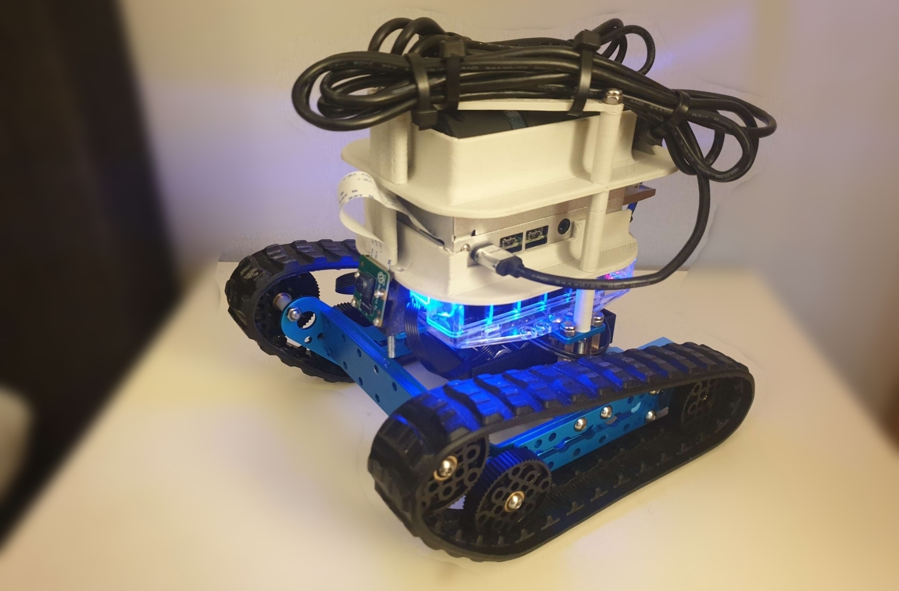
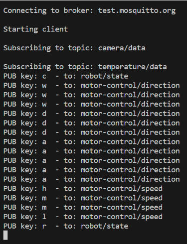
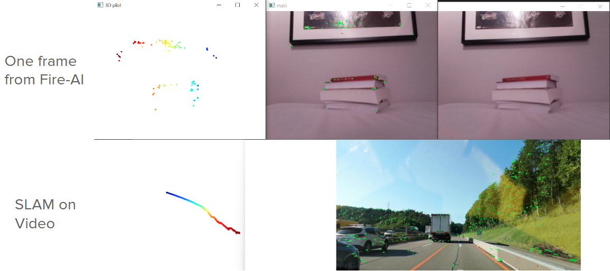

# Fire-AI (pronounced "Fire Eye") - SLAM using Raspberry Pi and Pi Camera with MQTT

## Overview
This repository contain software and miscellenous content from the project performed during the course "Embedded and Distributed" AI during the second year of the program "AI Engineering" at Jönköping University, Sweden.
The project has been executed by four students found in the contact section.
"Fire-AI" is the name of the robot seen in the figure below which consists of a powerbank, Raspberry Pi 4B, PiCamera v.2, and a MBot Ranger.
The MBot code is written in C++/INO while the RPi and controller device code is written in Python using common libraries.
<div align="center">
  
</div>

## Features
- Custom SIFT-based SLAM implementation using OpenCV (can be run on RPi or controller device)
- Implemented for a Raspberry Pi 4B and PiCamera v.2 (any camera compatible with OpenCV can work)
- Real-time mapping capabilities
- MQTT integration for communication between devices via Mosquitto test server
- MBot controllable via serial communication from RPi
- MBot temperature sensor data published to controller device for further implementation (TODO)

## Installation
This system consists of three parts of the software being run:

1. MBot software
2. RPi software
3. Controller device software

The physical assembly of the robot is according to the figure seen in the overview of this GitHub with the CAD-files of all parts available in the folder "CAD".
See each subsection for installation

### MBot installation
The folder "Mbot" contain a PlatformIO project developed in Visual Studio Code.
Follow Visual Studio Code and PlatformIO official documentation for installation instructions for installation of application, package and the opening and accessing the code for uploading to the MBot.
The code is uploaded to the MBot via PlatformIO "Build" and "Upload" via an USB type B cable.
See correct board settings below.

 - Platform: atmelavr
 - Board: megaatmega2560
 - Framework: arduino

The MBot is assembled according to MBot's official assembly instructions (does not incorporate ultrasonic sensor or IR sensor).

### RPi installation
The folder "Pi" contain all code required to be run on the RPi.
The system is started by running the file "main.py" using Python 3.10.
See the file "requirements.txt" for a complete list of Python libraries and packages needed for the system.
To install all libraries, run:

```python
pip install requirements.txt
```

in an environment that uses Python 3.10 (due to Open3D not supporting later versions).
Place the folder "Pi" on the desktop of the RPi.

#### run_script.sh
Since the RPi should run the "main.py" during the startup of the RPi without any interaction, a startup script is required in order to run the code. The file is found in the folder "Pi" and needs to be run during boot. Steps to incorporate this feature:

1. Open a terminal
2. Change directory to ~/.config/
3. If there is no folder "autostart", create one, and change to the folders directory in the terminal
4. Create a new file in the "autostart" folder named "run_script.desktop".
5. Insert the following into the file (ensure that the path is correct - ensuring case sensitivity and correct username):

```
[Desktop Entry]
Type=Application
Name=Run My Script
Exec=lxterminal -e /home/pi/Desktop/Pi/run_script.sh
```

6. Provide the run_script.sh file in the folder "Pi" correct permissions by changing directory in the terminal to the "Pi" folder with the code and running:

```
chmod +x /path/to/your/run_script.sh
```

Note: Recommended to rerun this command each time the file is changed or overwritten

7. Now, a terminal should appear shortly after GUI startup and will wait for 10 seconds before continuing with the Python script.

### Controller device installation

The controller is started by running the file "robot_controller.py" using Python 3.10 (preferrably on a device separate from the RPi running the system but for testing purposes it works).
The file is placed in the "Pi" folder since it may take advantage of other local code files found in the same directory to simplify the development.
See the file "requirements.txt" for a complete list of Python libraries and packages needed for the system.
To install all libraries, run:

```python
pip install requirements.txt
```

in an environment that uses Python 3.10 (due to Open3D not supporting later versions).


### Prerequisites
- Powerbank to power the RPi
- USB type C cable to power the RPi via the aforementioned powerbank
- Raspberry Pi 4B (others may apply)
- SD card for RPi (Raspberry Pi OS 64-bit)
- MBot ranger
- USB type B cable for serial communication between RPi and MBot
- Batteries for MBot battery pack (for the driving motors)
- Sufficient skill in RPi/Linux-based OS-interface and programming understanding
- A device to run the robot controller script (any system with internet connection and Python 3.10 support (Windows computer used during the project))
- Internet connection

## Usage

The following section contain steps on how to start the system.

### Running MBot

The MBot control board can be powered by the USB type B cable used for serial communication.
However, to enable the motors, there is a button next to the USB type B cable port on the MBot control board which enables the battery pack powering the driving motors.
The system is automatically up and running as soon as the MBot is powered on and start dimming the onboard LEDs up and down in a blue color (indication of being in standby state).

### Running RPi

The RPi system runs automatically using the run_script.sh file described above.
But one can start the script manually inside the RPi also.
The script can be run manually with:

```
python main.py
```

or:

```
python3 main.py
```

depending on your RPi Python configurations.
The script can also be run with the input argument:

```
--camera-off
```

if one wishes to run the system without the camera data being sent via MQTT.

### Running Controller device

The controller script must be run manually with:

```
python robot_controller.py
```

or:

```
python3 robot_controller.py
```

depending on your Python configurations.
An example output looks like this when up and running:
<div align="center">
  
</div>

### Example
See video "Demo.mp4" in "Misc_content" for a short demonstration of how the system runs.
See the following figure for two example visualizations; the above visualization is of one singular fram where the keypoints have been directly represented as 3D points whereas the visualization beneath is the resulting visualization of a car driving on a road where the 3D points follow the camera's path.
<div align="center">
  
</div>

## Contributing
This project is open-source; any person can use this project for their own use (use it at your own risk - we offer no guarantees).
Modify and use it for your purpose - or improve if you want to!

## Contact
Contact us via GitHub.
